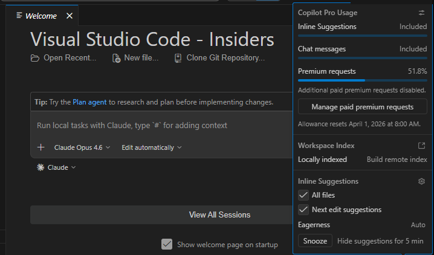
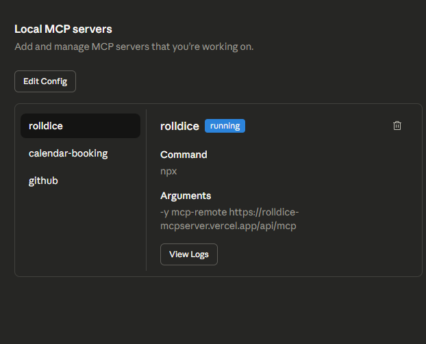

# AI Agent Dev Setup - Karl Andrei G. Castillo

## About

- **Name:** Karl Andrei G. Castillo
- **Workshop Cohort:** AI Agent Developer Bootcamp 2026
- **Repository:** [ai-agent-dev-setup-kuraedev](https://github.com/Kuraedev/boiler-plate-nextjs)

---

## Development Environment Checklist

### Node.js Installed

- **Version:** v24.13.1
- **Screenshot:** *(Add screenshot of `node --version` terminal output here)*

### Git Installed

- **Version:** 2.53.0.windows.1
- **Screenshot:** *(Add screenshot of `git --version` terminal output here)*

### VS Code Insiders with GitHub Copilot

- **Status:** Installed and running
- **Screenshot:** *(Add screenshot of VS Code Insiders with Copilot enabled)*

### Claude Desktop with MCP Servers

- **Status:** All 4 MCP servers connected
- **Screenshot:** *(Add screenshot of Claude Desktop showing connected MCP servers)*

---

## MCP Server Explanations

### 1. Rolldice Server
A demonstration MCP server that provides dice-rolling functionality. It serves as a simple proof-of-concept to verify that the MCP protocol is working correctly between Claude Desktop and external tools. When invoked, Claude can roll dice with configurable parameters and return random results.

### 2. Bootcamp AI Agent Server
A dedicated MCP server designed for the AI Agent Developer bootcamp. It provides workshop-specific tools that enable Claude to assist participants with bootcamp exercises, code reviews, and hands-on learning activities throughout the program.

### 3. Calendar Booking Server
A productivity-focused MCP server that allows Claude to interact with calendar and scheduling systems. It demonstrates how AI agents can bridge into real-world workflows by checking availability, creating bookings, and managing calendar entries.

### 4. GitHub Server
Connects Claude Desktop directly to GitHub's API using a Personal Access Token. This enables Claude to browse repositories, read and create issues, manage pull requests, and access file contents — making version control an integrated part of the AI-assisted development workflow.

---

## Troubleshooting Notes

### Issues Encountered & Solutions

1. **MCP config file not found**
   - **Problem:** Claude Desktop config file did not exist at the expected path.
   - **Solution:** Created the file manually at `%APPDATA%/Claude/claude_desktop_config.json` with the correct JSON structure.

2. **GitHub MCP server authentication**
   - **Problem:** GitHub server requires a Personal Access Token to connect.
   - **Solution:** Generated a classic token at GitHub > Settings > Developer Settings > Personal Access Tokens with `repo`, `read:org`, and `read:user` scopes.

3. **MCP servers not appearing after config change**
   - **Problem:** After editing the config file, MCP servers did not show up in Claude Desktop.
   - **Solution:** Fully quit Claude Desktop (not just close the window) and reopened it. MCP servers appeared after restart.

> **Tip:** If you encounter issues, always check the Claude Desktop logs and ensure your `claude_desktop_config.json` is valid JSON (no trailing commas, correct syntax).
